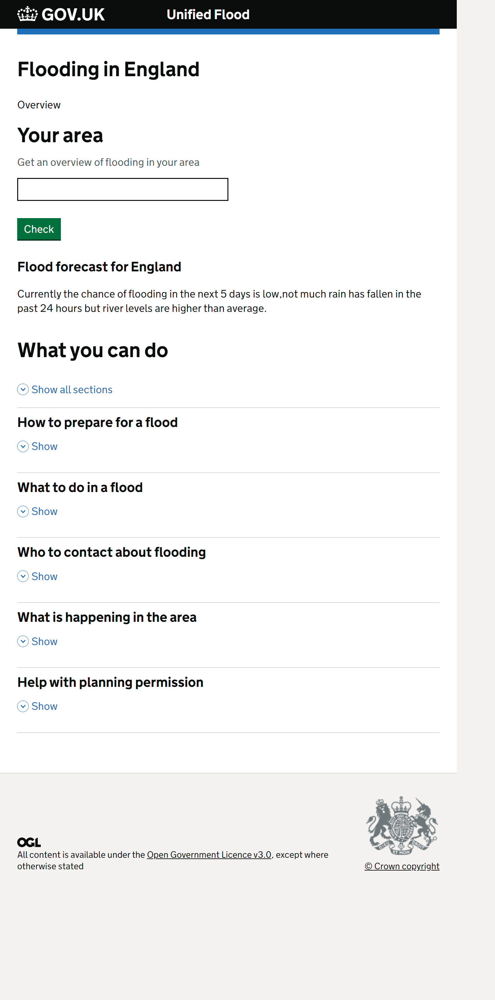
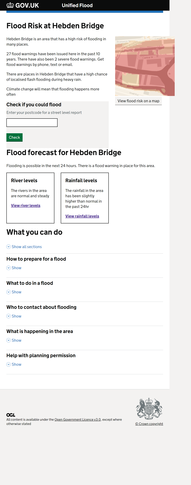
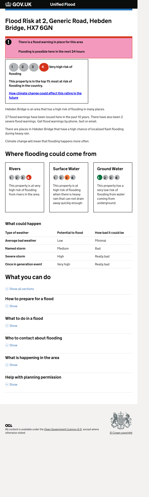

# unified-flood-digital
Unified Flood Digital project

# Installation

Use Node version 14 or less due to a bug in HAPI versions below 20.
Node Version manager (nvm) is the best way to achieve this.

```
  npm install 
  npm run postinstall
  npm start
```

# Valid routes

### National flood information
```
    http://server
```

### Area flood information

```
    http://server/town/{id}
```

### Local flood information

#### By property
```
    http://server/property/{id}
```

#### By postcode

Note that spaces are replaced by dashes

```
    http://server/postcode/{postcode}
    http://server/postcode/CV1-1AA
```
# Screenshots

### National view



### Town (Area) view




### Local view


